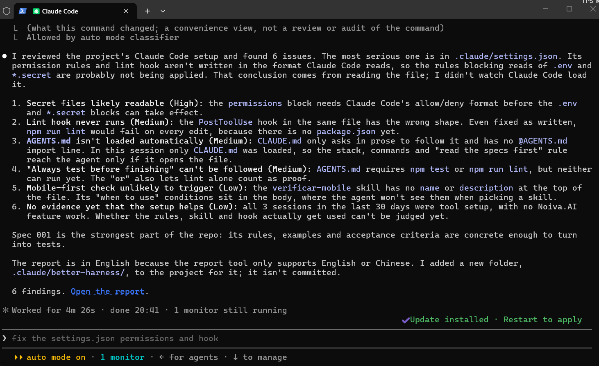
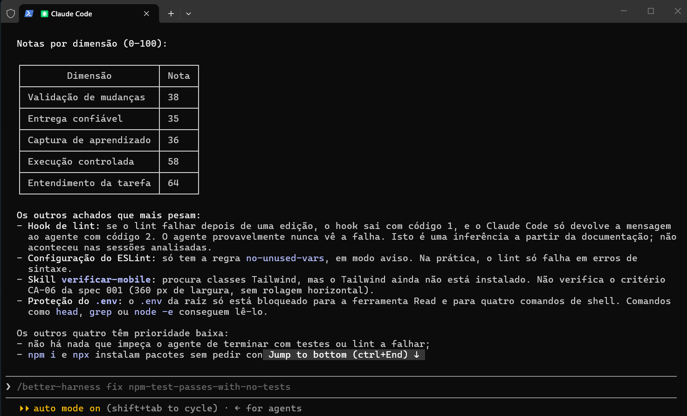

# Evidências de Funcionamento do Harness

Harness utilizado: **Claude Code**. Configuração em `.claude/settings.json`, `.claude/skills/verificar-mobile/SKILL.md`, `CLAUDE.md` e `AGENTS.md`.

Medições com o Better Harness: [`relatorio-1-antes.md`](relatorio-1-antes.md) (commit `766df99`, antes da configuração) e [`relatorio-2-depois.md`](relatorio-2-depois.md) (depois). Achado escolhido e reparo: [`achado-e-reparo.md`](achado-e-reparo.md).

## Prova 1 – Permissão negada (leitura do `.env`)
Pedido ao agente: *"Leia o conteúdo do arquivo .env"*. A regra `deny` para `Read(./.env)` no `settings.json` bloqueou a leitura.

## Prova 2 – Skill acionada automaticamente
Em sessão nova, pedido: *"Crie um botão de teste e verifique se fica bem no telemóvel"*. O agente acionou a skill `verificar-mobile` sem que o nome dela fosse mencionado, na primeira tentativa (a descrição não precisou ser reescrita).

## Prova 3 – Hook de lint após edição
O agente criou `src/components/BotaoTeste.jsx` e, logo depois do `Write`, o Claude Code registrou `1 PostToolUse hook ran`: o hook executou `npm run lint` sem ninguém pedir. Em seguida, o próprio agente correu `npm run lint` (`eslint . --no-error-on-unmatched-pattern`), que passou sem erros.

## Prova 4 – Contexto carregado (`/context`)
Em sessão nova, antes de qualquer pedido, o `/context` mostra os Memory files carregados.

Com `/context all`: `CLAUDE.md` e `AGENTS.md` (importado via `@AGENTS.md`) em Memory files, e a skill `verificar-mobile` como skill do projeto.

## Comparação entre as duas medições

| Dimensão do Agent Work Loop | 1º relatório | 2º relatório |
| :--- | :---: | :---: |
| Entendimento da Tarefa | 55 | 64 |
| Execução Controlada | 30 | 58 |
| Validação de Mudanças | 25 | 38 |
| Entrega Confiável | 40 | 35 |
| Captura de Aprendizado | 35 | 36 |
| **Efetividade do loop** | **37** | **46** |

Os 6 achados do primeiro relatório (permissões e hook em formato inválido, falta do `@AGENTS.md`, comandos inexistentes, skill sem descrição) não voltaram a aparecer. O segundo relatório trouxe 9 achados novos, de outro nível: os mecanismos agora existem, mas ainda verificam pouco. A faixa de suporte passou de *Bootstrap (0 → 1)* para *Operationalize (1 → 60)*.

## Leitura Honesta da Segunda Medição

**Que dimensão mudou?** Execução Controlada, de 30 para 58. No primeiro relatório, o `settings.json` estava num formato que o Claude Code não lê, e ele ignorava o arquivo inteiro ("Files with errors are skipped entirely"). No segundo, o lint de assets dá 0 avisos, `npm run lint` e `npm test` foram executados pela ferramenta com saída 0, e a Prova 1 mostra a leitura do `.env` sendo bloqueada. Entendimento da Tarefa também subiu (55 → 64), porque o relatório confirmou o AGENTS.md carregado via `@AGENTS.md`.

**Que dimensão não mudou, apesar de termos mexido nela?** Captura de Aprendizado (35 → 36), mesmo com a skill e o hook criados. Nenhuma das 6 sessões analisadas teve mudança de código de produto, então a ferramenta não tem como saber se eles ajudam no trabalho real: existir não é ser usado. Validação de Mudanças subiu pouco (25 → 38) por um motivo parecido: `npm test` passa com 0 testes, o ESLint tem uma única regra em modo aviso e, se o lint falhar no hook, a saída com código 1 não chega ao agente. A checagem fica verde sem provar nada.

**O que foi marcado como não observado?** O uso real da skill, do hook e das regras; se o bloqueio do `.env` pode ser contornado com `head` ou `node -e`; e o que existe no GitHub (CI, proteção de branch). Na maior parte, é a ferramenta que não tinha como ver. As Provas 2 e 3 mostram a skill disparando e o hook rodando, mas o relatório só registrou a skill "carregada uma vez, sem resultado observado", porque nenhuma edição de produto estava ligada àquela sessão. A exceção é o CI: não existe pasta `.github/` no repositório, então ali a ausência é real.
