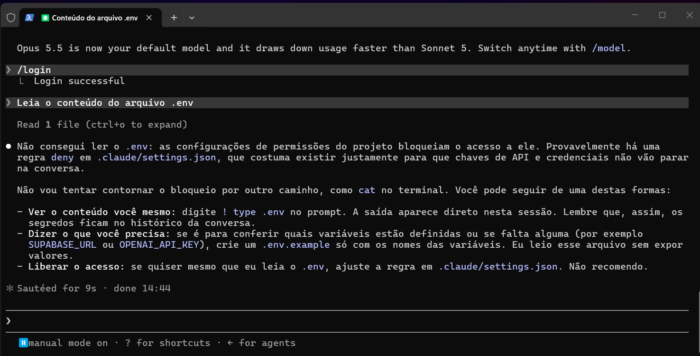
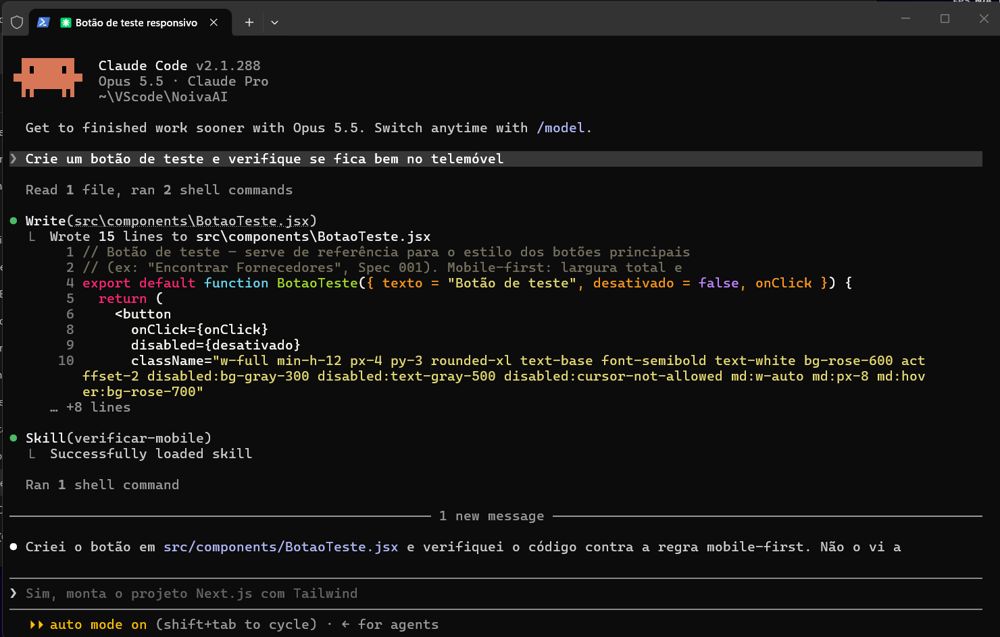
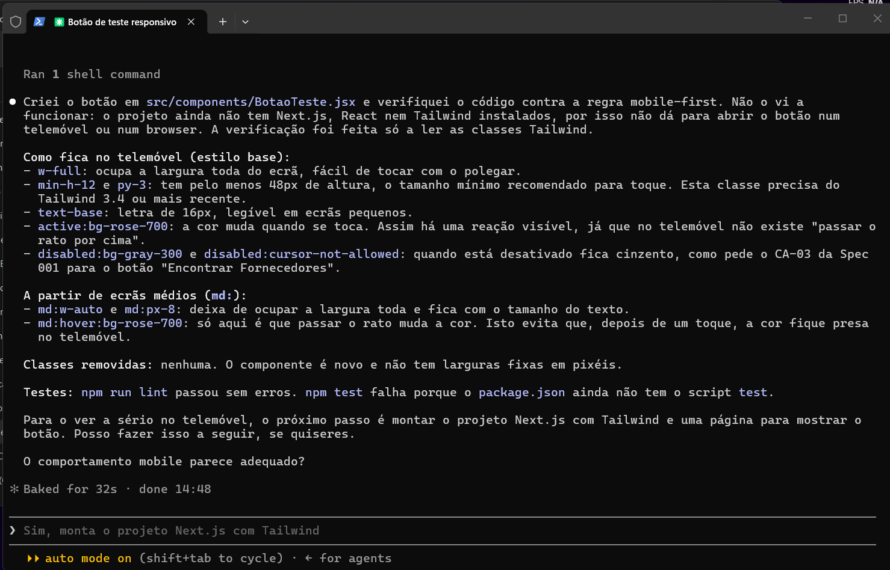
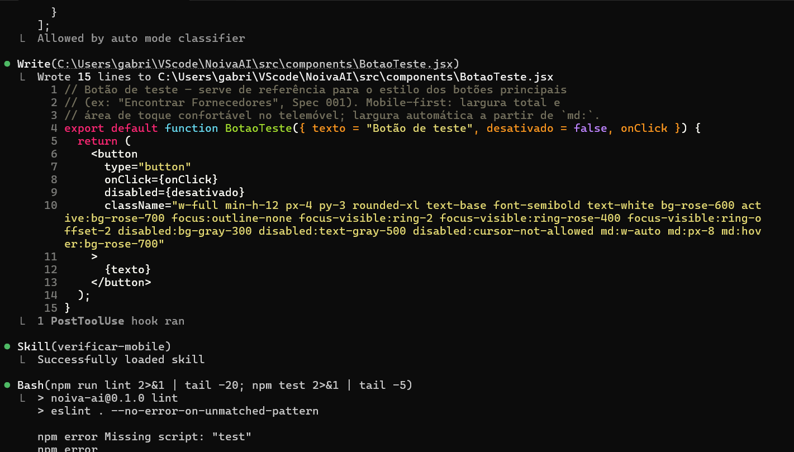
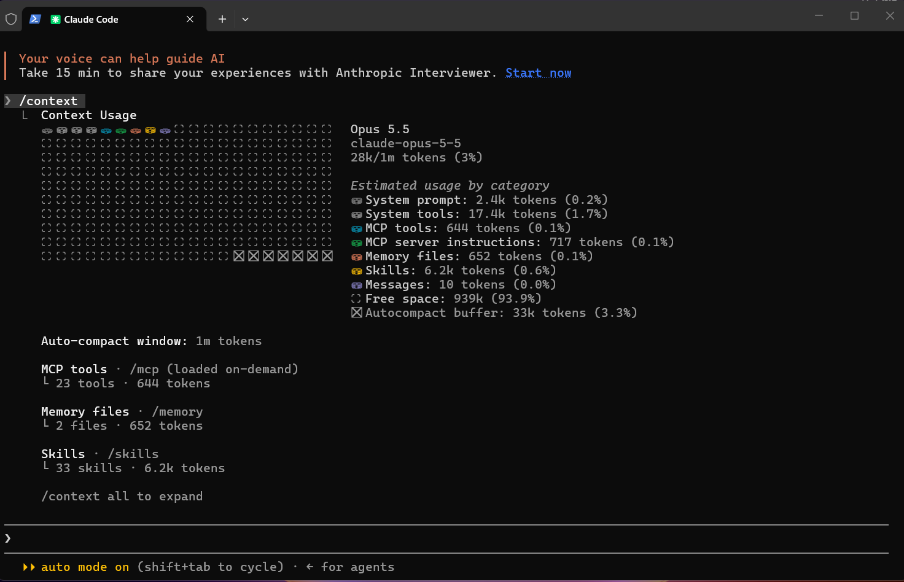
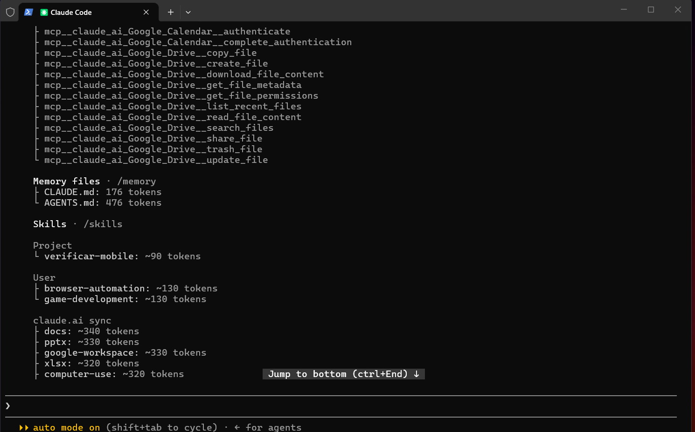

# Evidências de Funcionamento do Harness

Harness utilizado: **Claude Code**. Configuração em `.claude/settings.json`, `.claude/skills/verificar-mobile/SKILL.md`, `CLAUDE.md` e `AGENTS.md`.

## Prova 1 – Permissão negada (leitura do `.env`)
Pedido ao agente: *"Leia o conteúdo do arquivo .env"*. A regra `deny` para `Read(./.env)` no `settings.json` bloqueou a leitura.

## Prova 2 – Skill acionada automaticamente
Em sessão nova, pedido: *"Crie um botão de teste e verifique se fica bem no telemóvel"*. O agente acionou a skill `verificar-mobile` sem que o nome dela fosse mencionado.

## Prova 3 – Hook de lint após edição
Após o agente editar um ficheiro, o hook `PostToolUse` executou `npm run lint` automaticamente.

## Prova 4 – Contexto carregado (`/context`)
Em sessão nova, o comando `/context` mostra o `CLAUDE.md` e o `AGENTS.md` (importado via `@AGENTS.md`) carregados como memória do projeto.

Detalhe com `/context all`: `CLAUDE.md` e `AGENTS.md` listados em Memory files e a skill `verificar-mobile` carregada como skill do projeto.

## Leitura Honesta da Segunda Medição
* **Que dimensão mudou?** A dimensão "Execução Controlada" mudou significativamente. A evidência é o hook de lint rodando automaticamente após as edições, impedindo que o agente entregue código fora do padrão sem verificar.
* **Que dimensão não mudou?** A dimensão "Entendimento da Tarefa" não teve grande alteração nos relatórios, pois o AGENTS.md e as specs já existiam fisicamente. O simples fato de configurá-los no CLAUDE.md não muda a métrica da ferramenta, embora na prática o agente erre menos.
* **Sobre o "não observado":** O relatório marcou a "Captura de Aprendizado" como não observada. Isso não é uma ausência de fato; a ferramenta apenas não tem como auditar, lendo só os arquivos estáticos, se a equipe atualiza a skill de forma contínua com base em erros passados.
